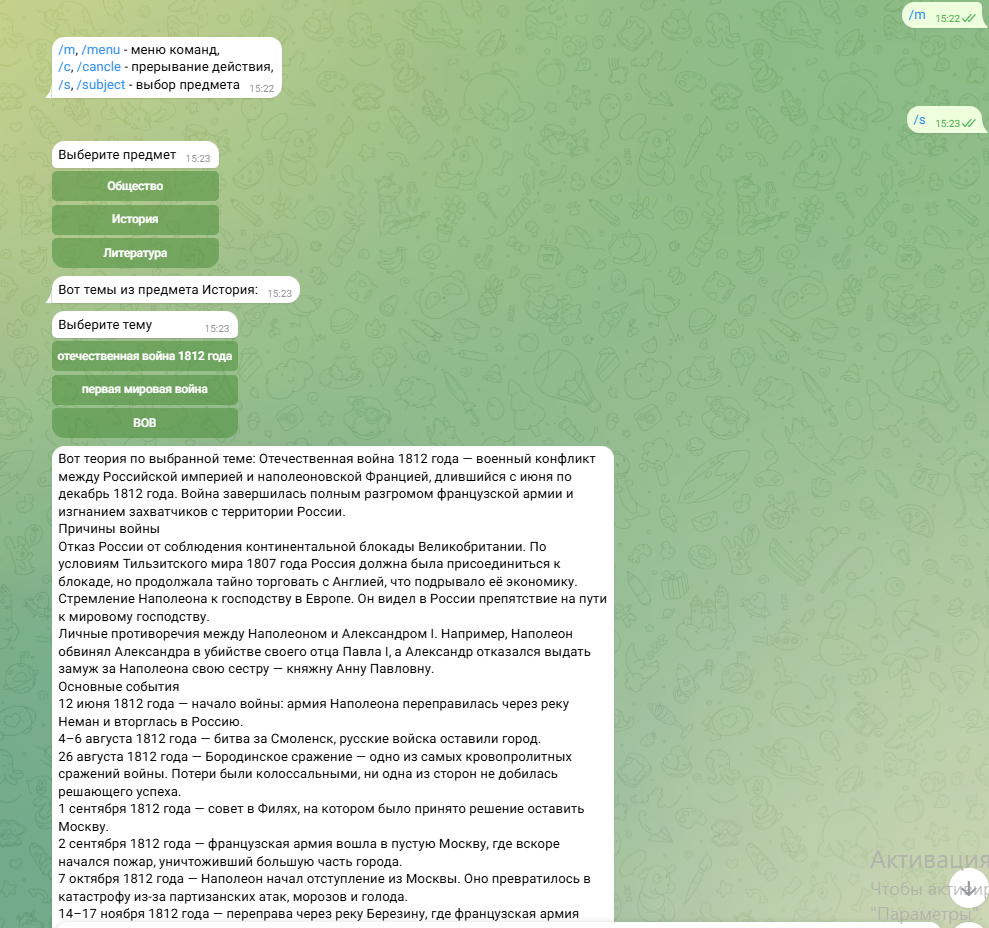
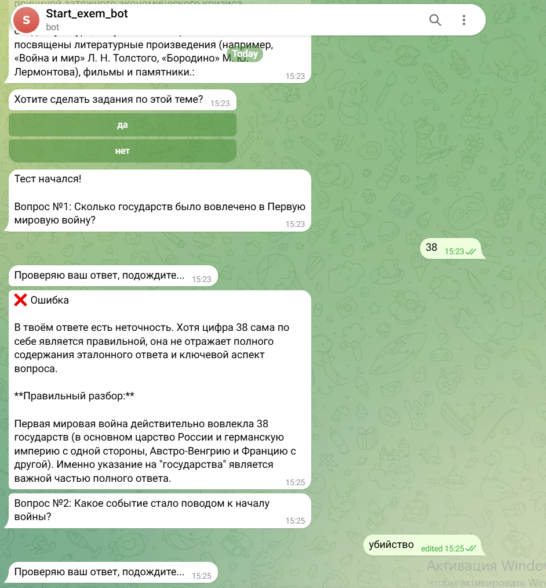

# AI-Репетитор для подготовки к ОГЭ/ЕГЭ (Telegram Bot)

Интерактивный Telegram-бот для самостоятельной подготовки школьников к экзаменам. Бот позволяет выбрать класс, предмет и конкретную тему, изучить теорию, пройти тестирование и получить развернутый разбор ошибок от локальной нейросети **DeepSeek** через **Ollama**.

## 🚀 Ключевой функционал
* **Гибкая траектория**: Пользователь сам выбирает — идти по строгому учебному плану или выбирать интересующие темы точечно.
* **Интерактивная проверка**: Вместо простых тестов бот принимает развернутые текстовые ответы учеников.
* **Локальный ИИ-наставник**: Интеграция с **DeepSeek** (через Ollama) для анализа ответов, генерации персональных рекомендаций и разбора ошибок в режиме реального времени.
* **Надежное хранение данных**: Архитектура базы данных спроектирована на **SQLite** для хранения структуры курсов, теории и прогресса пользователей.

## 🛠 Технологический стек
* **Язык**: Python 3.x
* **Библиотеки**: [Укажи здесь библиотеку бота, например: Telebot / Aiogram]
* **База данных**: SQLite
* **ИИ-движок**: Ollama (модель DeepSeek)

## 📦 Архитектура базы данных (SQLite)
В проекте реализована реляционная структура таблиц для управления контентом:
* `users` — профили учеников (класс, выбранный предмет).
* `subjects_and_themes` — справочник предметов, классов и связанных с ними тем.
* `theory_and_tests` — учебные материалы, вопросы к урокам и эталоны ответов.

## ⚙️ Инструкция по локальному запуску

### 1. Требования
* Установленный Python версии 3.10+
* Установленная утилита [Ollama](https://ollama.com)

### 2. Развертывание ИИ-модели
Запустите Ollama и скачайте модель DeepSeek в терминале:
```bash
ollama run deepseek-r1:7b
```
*(Примечание: или укажите другую версию модели, которую вы использовали, например deepseek-r1:1.5b)*

### 3. Установка зависимостей
Клонируйте репозиторий и установите библиотеки:
```bash
git clone github.com[ТВОЙ_НИК_НА_GITHUB]/[ИМЯ_РЕПОЗИТОРИЯ].git
cd [ИМЯ_РЕПОЗИТОРИЯ]
pip install -r requirements.txt
```

### 4. Настройка переменных окружения
Создайте файл `.env` в корневой директории и добавьте ваш токен бота:
```env
BOT_TOKEN=your_telegram_bot_token_here
```

### 5. Запуск бота
```bash
python main.py
```

## 📸 Скриншоты работы
<p align="center">
  
  
</p>